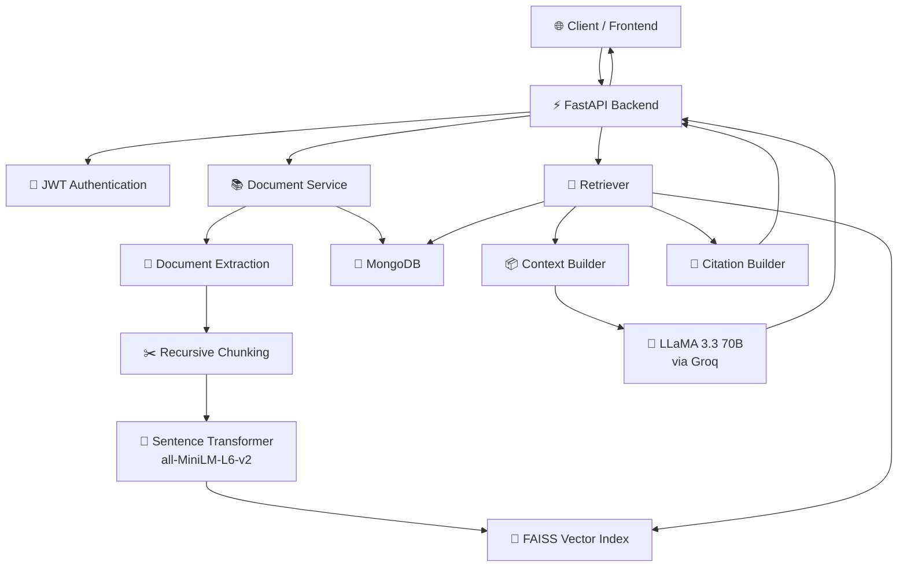
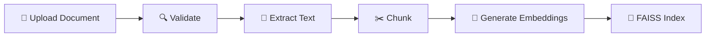
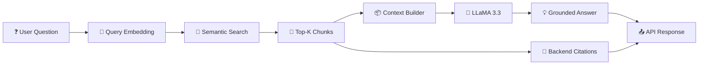

# 🧠 RAG Study Buddy

> **Your personal AI study companion — grounded in your own documents.**

RAG Study Buddy is a production-oriented AI study assistant that lets students upload their **PDFs, lecture notes, TXT/Markdown files, and study material**, then ask questions and receive **context-aware answers with document-level citations**.

Instead of blindly asking an LLM, RAG Study Buddy first searches your uploaded knowledge base, retrieves the most relevant content, and then gives that context to the LLM.

The result?

**Answers grounded in your actual study material — not random AI hallucinations.**

---

## ✨ What Makes It Different?

Most AI chat applications follow:

```text
User → LLM → Answer
````

RAG Study Buddy follows:

```text
User
  ↓
Authentication
  ↓
Your Documents
  ↓
Document Processing
  ↓
Chunking
  ↓
Embeddings
  ↓
FAISS Vector Search
  ↓
Relevant Context
  ↓
LLaMA 3
  ↓
Grounded Answer + Citations
```

Every user's knowledge base is isolated, and citations are generated by the backend from the retrieved document metadata.

---

# 🚀 Core Features

### 📚 Document-Based Learning

Upload your study material:

* PDF
* TXT
* Markdown
* Lecture notes
* Study guides
* Quiz sheets

Documents are automatically:

1. Validated
2. Extracted
3. Split into chunks
4. Converted into embeddings
5. Indexed in FAISS
6. Stored with citation metadata

---

### 🔎 Semantic Search

Instead of searching for exact keywords, the system understands the **meaning** of your question.

Powered by:

* `all-MiniLM-L6-v2`
* Sentence Transformers
* FAISS
* Cosine similarity

Example:

```text
Question:
"Explain why deadlock can occur in operating systems."

        ↓

Semantic Retrieval

        ↓

Relevant chunks from:
Operating_Systems.pdf
Pages 42, 43, 45

        ↓

LLM Context

        ↓

Grounded Answer
```

---

### 🤖 AI-Powered Answers

The system uses:

**LLaMA 3.3 70B via Groq**

The LLM receives only the relevant retrieved context instead of the entire document collection.

This improves:

* Relevance
* Context efficiency
* Grounding
* Response quality

---

### 📌 Source Citations

Every response can include structured source information:

```json
{
  "filename": "Operating_Systems.pdf",
  "page": 42
}
```

Citation metadata is generated by the backend from the retrieval results.

The LLM **does not control citation metadata**.

This prevents the model from inventing sources.

---

### 💬 Persistent Chat Memory

Conversations are stored in MongoDB.

The assistant can use recent conversation history to understand follow-up questions.

Example:

```text
You:
What is deadlock?

AI:
Deadlock is a situation where...

You:
What are its four conditions?

AI:
The four necessary conditions are...
```

The second question can use the context of the previous conversation.

---

### 🔐 Secure Multi-User Architecture

Each user gets an isolated knowledge space.

The system enforces:

```text
User A
 ├── Documents
 ├── Chunks
 └── FAISS Indexes

User B
 ├── Documents
 ├── Chunks
 └── FAISS Indexes
```

User A can never retrieve User B's documents.

Authentication is handled through:

* JWT
* bcrypt password hashing
* Authenticated route dependencies
* User-scoped database queries
* User-scoped filesystem paths
* User-scoped FAISS indexes

---

# 🏗️ System Architecture



---

# 🔄 RAG Pipeline



When the user asks a question:



---

# 🧩 Architecture Philosophy

RAG Study Buddy intentionally avoids unnecessary infrastructure complexity.

### We don't use:

* ❌ Microservices
* ❌ Kubernetes
* ❌ Redis
* ❌ Message queues
* ❌ Complex agent frameworks
* ❌ Deprecated `RetrievalQA`
* ❌ External embedding APIs

Instead:

```text
FastAPI
   +
MongoDB
   +
FAISS
   +
Sentence Transformers
   +
Groq
```

Simple enough to understand.

Powerful enough to deploy.

---

# 🛠️ Tech Stack

| Layer            | Technology                |
| ---------------- | ------------------------- |
| Backend          | FastAPI                   |
| Language         | Python 3.12               |
| Database         | MongoDB                   |
| Authentication   | JWT + bcrypt              |
| Vector Database  | FAISS                     |
| Embeddings       | Sentence Transformers     |
| Embedding Model  | all-MiniLM-L6-v2          |
| LLM              | LLaMA 3.3 70B             |
| LLM Provider     | Groq                      |
| RAG              | Custom Retrieval Pipeline |
| Containerization | Docker                    |
| Deployment       | Render                    |
| Testing          | Pytest                    |
| Code Quality     | Ruff                      |

---

# 📁 Project Structure

```text
rag-study-buddy/
│
├── app/
│   ├── api/
│   │   ├── auth.py
│   │   ├── chat.py
│   │   └── documents.py
│   │
│   ├── core/
│   │   ├── config.py
│   │   ├── database.py
│   │   ├── dependencies.py
│   │   └── security.py
│   │
│   ├── rag/
│   │   ├── embeddings.py
│   │   ├── retriever.py
│   │   ├── context.py
│   │   └── llm.py
│   │
│   ├── services/
│   │   ├── chat.py
│   │   ├── documents.py
│   │   └── users.py
│   │
│   ├── schemas/
│   │
│   └── main.py
│
├── tests/
│
├── data/
│   ├── documents/
│   └── faiss_index/
│
├── Dockerfile
├── docker-compose.yml
├── render.yaml
├── requirements.txt
├── requirements-dev.txt
├── pyproject.toml
├── .env.example
└── README.md
```

---

# 🔐 Security Model

Security is treated as a core part of the architecture rather than an afterthought.

### Authentication

```text
Register
   ↓
bcrypt Password Hash
   ↓
MongoDB

Login
   ↓
JWT
   ↓
Authenticated Requests
```

### Authorization

The authenticated user's identity comes from the validated JWT.

```text
JWT
 ↓
user_id
 ↓
Mongo Query
 ↓
Filesystem
 ↓
FAISS
```

Client-provided user IDs are never trusted.

---

# 🛡️ API Hardening

The backend includes:

* JWT authentication
* Request validation
* Upload size limits
* File-type allowlists
* Path traversal protection
* Rate limiting
* CORS configuration
* Security response headers
* Safe error responses
* MongoDB readiness checks
* Input bounds
* FAISS corruption handling
* Failed indexing cleanup
* Prompt-injection-resistant context handling

Security headers include:

```text
X-Content-Type-Options: nosniff
X-Frame-Options: DENY
Referrer-Policy: strict-origin-when-cross-origin
```

---

# 🧪 Testing

The project includes automated tests covering:

* Health checks
* MongoDB integration
* Authentication
* JWT validation
* Document uploads
* PDF extraction
* Chunking
* Duplicate detection
* Embeddings
* FAISS indexing
* Retrieval
* Cross-user isolation
* Citations
* Chat memory
* API security
* Rate limiting
* Failure handling

Run:

```bash
pytest
```

Code quality:

```bash
ruff check .
```

---

# 🐳 Run with Docker

Clone the repository:

```bash
git clone https://github.com/Saptak20/RAG-Study-Buddy.git
cd RAG-Study-Buddy
```

Create your environment file:

```bash
cp .env.example .env
```

Add:

```env
MONGODB_URI=your_mongodb_uri
JWT_SECRET_KEY=your_secret
GROQ_API_KEY=your_groq_key
```

Start the application:

```bash
docker compose up --build
```

The API will be available at:

```text
http://localhost:8000
```

Health check:

```text
GET /health
```

---

# ☁️ Deployment

The application is containerized and designed for deployment on **Render**.

Production architecture:

```text
                    Internet
                       │
                       ▼
                ┌─────────────┐
                │   Render    │
                │   Web App   │
                └──────┬──────┘
                       │
             ┌─────────┴─────────┐
             │                   │
             ▼                   ▼
       ┌───────────┐       ┌────────────┐
       │ MongoDB   │       │   Groq     │
       │   Atlas   │       │   LLaMA 3  │
       └───────────┘       └────────────┘
             ▲
             │
       Application Data
             │
       ┌──────────────┐
       │ Persistent   │
       │ Disk         │
       │              │
       │ Documents    │
       │ FAISS Index  │
       └──────────────┘
```

The persistent disk is required because FAISS indexes and uploaded document data are filesystem-backed.

---

# 📡 API Overview

### Authentication

```http
POST /auth/register
POST /auth/login
GET  /auth/me
```

### Documents

```http
POST   /documents/upload
GET    /documents
DELETE /documents/{document_id}
```

### Chat

```http
POST   /chat
GET    /chat/history
DELETE /chat/history
```

### Health

```http
GET /health
GET /health/ready
```

---

# ⚡ Example RAG Interaction

### Upload

```text
Operating Systems.pdf
        ↓
     12.4 MB
        ↓
Text Extraction
        ↓
     184 chunks
        ↓
Embeddings
        ↓
FAISS Index
```

### Ask

```text
"What are the necessary conditions for deadlock?"
```

### Retrieval

```text
Top-K Results

1. Operating Systems.pdf — Page 42
2. Operating Systems.pdf — Page 43
3. Operating Systems.pdf — Page 45
```

### Generation

```text
Retrieved Context
       ↓
LLaMA 3.3 70B
       ↓
Grounded Response
```

### Response

```json
{
  "answer": "Deadlock requires four necessary conditions...",
  "sources": [
    {
      "filename": "Operating Systems.pdf",
      "page": 42
    },
    {
      "filename": "Operating Systems.pdf",
      "page": 43
    }
  ]
}
```

---

# 🧠 Design Principles

### 1. Ground the model

The LLM should answer from retrieved evidence whenever possible.

### 2. Keep citations deterministic

The backend owns citation metadata.

### 3. Isolate users

Every user's documents, chunks, and vector indexes are scoped to that user.

### 4. Fail safely

External failures should produce controlled API errors rather than crashes.

### 5. Avoid unnecessary complexity

Architecture should solve the actual problem, not win a diagram competition.

### 6. Make the system replaceable

LLM and embedding services are abstracted so implementations can be swapped later.

---

# 🗺️ Roadmap

### ✅ Completed

* [x] FastAPI backend
* [x] MongoDB integration
* [x] JWT authentication
* [x] Document ingestion
* [x] PDF/TXT/Markdown support
* [x] Chunking
* [x] Local embeddings
* [x] FAISS vector search
* [x] RAG generation
* [x] Groq integration
* [x] Source citations
* [x] Persistent chat memory
* [x] Security hardening
* [x] Docker
* [x] Production configuration
* [x] Render deployment configuration

### 🔮 Planned

* [ ] React / Next.js frontend
* [ ] Interactive study dashboard
* [ ] AI-generated quizzes
* [ ] Adaptive learning
* [ ] Flashcards
* [ ] Anki export
* [ ] YouTube transcript ingestion
* [ ] Voice interaction
* [ ] Document sharing
* [ ] Personalized learning roadmap
* [ ] Study analytics

---

# 🎯 Future Vision

RAG Study Buddy is designed to evolve from a document-question-answering system into a complete **AI learning environment**.

```text
                  RAG Study Buddy
                        │
       ┌────────────────┼────────────────┐
       │                │                │
       ▼                ▼                ▼
   📚 Documents      🤖 AI Tutor      🧠 Memory
       │                │                │
       └────────────────┼────────────────┘
                        │
                        ▼
                🎓 Personalized
                  Learning
                        │
          ┌─────────────┼─────────────┐
          ▼             ▼             ▼
       Quizzes       Flashcards    Roadmaps
          │             │             │
          └─────────────┼─────────────┘
                        ▼
                  Better Learning
```

---

# 👨‍💻 Author

**Saptak Mondal**

B.Tech CSE — AI/ML & IoT

Interested in:

* AI Engineering
* Machine Learning
* RAG Systems
* Backend Engineering
* System Design
* Computer Vision

---

## ⭐ If you find this project interesting

Give the repository a ⭐ and feel free to explore the architecture, implementation, and ideas behind the system.

---

<p align="center">

**Built with Python • FastAPI • MongoDB • FAISS • Sentence Transformers • LLaMA 3 • Groq**

</p>
```
